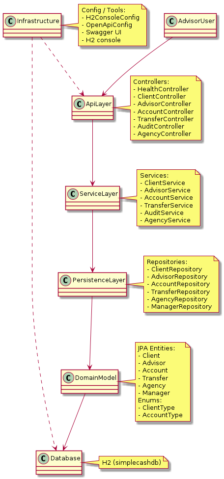
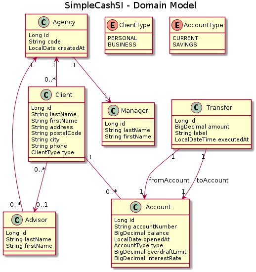

# SimpleCashSI v4

Application backend **Spring Boot / JPA / REST** pour la banque fictive **SimpleCash**.  
L’objectif est de fournir un SI permettant aux conseillers :

- de **gérer les clients** et leurs conseillers/agences,
- de **gérer les comptes** (courant / épargne),
- de **créditer / débiter un compte**,
- de **faire des virements compte à compte**,
- de **lancer des audits** simples sur les comptes.

Le code est organisé en **architecture en couches** (controllers / services / repositories / domain model), et expose une API REST documentée automatiquement via **Swagger/OpenAPI**.

---

## 1. Stack technique

- **Langage** : Java 17
- **Framework** : Spring Boot 4.x
    - spring-boot-starter-webmvc
    - spring-boot-starter-data-jpa
    - spring-boot-starter-validation
- **Base de données** : H2 (in-memory) avec **JPA / Hibernate**
- **Build** : Maven
- **Tests** : JUnit 5, Mockito, AssertJ
- **Documentation API** : Springdoc OpenAPI / Swagger UI

---

## 2. Démarrage rapide

### 2.1. Prérequis

- Java 17 installé (`java -version`)
- Maven installé (`mvn -v`)

### 2.2. Lancer l’application

À la racine du projet :

```bash
mvn clean spring-boot:run
```

L’application démarre sur :

API : http://localhost:8080

Swagger UI : http://localhost:8080/swagger-ui/index.html#/

Au lancement, la base H2 est automatiquement créée et peuplée grâce au fichier data.sql.

## 3. Base de données & données d’exemple

### 3.1. Configuration H2

La base en mémoire est configurée comme :

- URL : `jdbc:h2:mem:simplecashdb`
- User : `sa`
- Password : *(vide)*

Le schéma est créé automatiquement par Hibernate via :

```properties
spring.jpa.hibernate.ddl-auto=update
spring.jpa.show-sql=true
spring.jpa.defer-datasource-initialization=true
spring.sql.init.mode=always
```

## 4. API REST – Aperçu

L’API est pleinement documentée via Swagger :

👉 **Swagger UI** : http://localhost:8080/swagger-ui/index.html#/

Quelques endpoints principaux (non exhaustif, voir Swagger pour le détail) :

### 4.1. Santé

- `GET /api/health`  
  Retourne un simple statut de santé de l’application.

---

### 4.2. Clients

- `GET /api/clients`  
  Liste tous les clients.

- `GET /api/clients/{id}`  
  Récupère un client par son identifiant.

- `POST /api/clients`  
  Crée un client.

Exemple de corps JSON :

```json
{
  "lastName": "Dupont",
  "firstName": "Jean",
  "address": "1 rue de la Paix",
  "postalCode": "75001",
  "city": "Paris",
  "phone": "0600000000",
  "agencyId": 1,
  "advisorId": 1,
  "clientType": "PERSONAL"
}
```

### 4.3. Advisors (conseillers)

- `GET /api/advisors`  
  Liste tous les conseillers.

- `GET /api/advisors/{id}`  
  Récupère un conseiller par son identifiant.

- `POST /api/advisors`  
  Crée un conseiller rattaché à une agence.

- `PUT /api/advisors/{id}`  
  Modifie un conseiller rattaché à une agence.

- `DELETE /api/advisors/{id}`  
  Supprime un conseiller rattaché à une agence.

### 4.4. Accounts (comptes bancaires)

- `GET /api/accounts`  
  Liste tous les comptes.

- `GET /api/accounts/{id}`  
  Récupère un compte par son identifiant.

- `POST /api/accounts`  
  Crée un compte pour un client (courant ou épargne).

- `POST /api/accounts/{id}/credit`  
  Crédite un compte.

### 4.5. Transferts (compte a compte)

- `POST /api/transfers`  
  Crée un virement entre deux comptes de la banque.

### 4.6. Audit

- `GET /api/audit/violations`  
  Crée un rapport des violations detectees sur les comptes.

- `GET /api/audit/summary`  
  Crée un rapport general de l'etat des comptes.

---

## 5. Architecture & Modèle métier

Deux diagrammes UML accompagnent le projet (générés avec PlantUML) :

- `architecture.png` : vue architecture en couches
- `domain_model.png` : vue du modèle métier

### 5.1. Architecture en couches



Couches principales :

- **API Layer** (Controllers)
    - `HealthController`
    - `ClientController`
    - `AdvisorController`
    - `AccountController`
    - `TransferController`
    - `AuditController`

- **Service Layer** (business)
    - `ClientService`
    - `AdvisorService`
    - `AccountService`
    - `TransferService`
    - `AuditService`

- **Persistence Layer** (Spring Data JPA Repositories)
    - `ClientRepository`
    - `AdvisorRepository`
    - `AgencyRepository`
    - `AccountRepository`
    - `TransferRepository`

- **Domain Model** (entités JPA)
    - `Client`, `Advisor`, `Agency`, `Manager`, `Account`, `Transfer`
    - `ClientType`, `AccountType`

- **Infrastructure / Config**
    - config H2
    - config OpenAPI / Swagger
    - health check, etc.

Principaux packages Java :

- `org.simplecash.client`
- `org.simplecash.advisor`
- `org.simplecash.agency`
- `org.simplecash.account`
- `org.simplecash.transfer`
- `org.simplecash.audit`
- `org.simplecash.config`
- `org.simplecash.common`

### 5.2. Modèle métier



Principales entités :

- `Client`
- `Advisor`
- `Agency`
- `Manager`
- `Account`
- `Transfer`
- `ClientType` (PERSONAL / BUSINESS)
- `AccountType` (CURRENT / SAVINGS)

Relations principales :

- Une **Agency** a :
    - **1 Manager**
    - **0..*** Advisors
    - **0..*** Clients

- Un **Client** :
    - appartient à **une Agency** (obligatoire),
    - est optionnellement suivi par **un Advisor** (0..1),
    - possède **0..*** `Account`.

- Un **Account** :
    - appartient à **un Client**,
    - est de type **CURRENT** (avec `overdraftLimit`) ou **SAVINGS** (avec `interestRate`).

- Un **Transfer** :
    - référence un compte source (`fromAccount`)
    - et un compte destinataire (`toAccount`).

---

## 6. Tests

Les tests unitaires s’appuient sur :

- **JUnit 5**
- **Mockito**
- **AssertJ**

L’objectif est de couvrir principalement la **logique métier** des services :

- `ClientServiceTest`
- `AccountServiceTest`
- `TransferServiceTest`
- `AdvisorServiceTest`
- `AuditServiceTest` (si présent)

Pour exécuter les tests :

```bash
mvn test
```
---

### Bloc 8 – Section 7 : User stories / Trello

Les **user stories** et la priorisation du travail sont gérées via un tableau Trello :

👉 https://trello.com/b/UKnf26DN/simplecash-v4

Organisation typique du board :

- **Backlog** : idées / fonctionnalités non commencées  
- **In Progress** : tâches en cours  
- **Done** : fonctionnalités livrées  

Ce board sert de support pour la partie **Concevoir – Formaliser** du sujet :

- user stories minimales,  
- priorisation des fonctionnalités,  
- suivi de ce qui a été réalisé pendant l’examen.

---

## 8. Limitations & pistes d’amélioration

Quelques pistes d’évolution possibles :

- Implémentation complète d’une **traçabilité AOP** spécifique pour les opérations sensibles (virements), avec un logger dédié.
- Mise en place de **simulations de crédit** par client, avec :
    - plafond de prêt,
    - durée,
    - taux d’intérêt et d’assurance propres au client / conseiller.
- Audit plus avancé :
    - rapport complet crédits / débits,
    - seuils paramétrables,
    - meilleure distinction comptes particuliers / entreprises.
- Mise en œuvre de la règle métier : **au plus 10 clients par conseiller**.
- Ajout de tests d’intégration (MockMvc / Testcontainers) pour valider l’enchaînement complet HTTP → services → base de données.
- Ajout d’une vraie gestion des cartes bancaires (Visa Electron / Visa Premier) et de leur désactivation lors de la suppression d’un client.

---

## 9. Authors

Maxence Dupont
